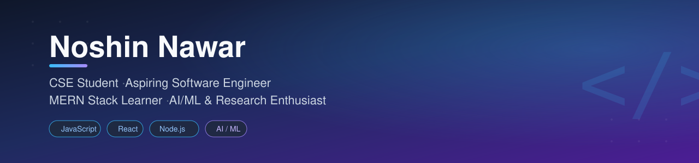

<!-- Banner -->

  

<h1 align="center">Hi 👋, I'm Noshin Nawar</h1>
<h3 align="center">CSE Student | Aspiring Software Engineer | MERN Stack Learner | AI/ML Enthusiast</h3>

  

## 👨‍💻 About Me

I am a Computer Science and Engineering student and an aspiring software engineer. I am currently learning the MERN Stack through Programming Hero and improving my full-stack web development skills.

I enjoy building projects, solving programming problems, and exploring AI/ML and research. I am continuously learning new technologies and applying my knowledge through practical projects.

## 🔭 Currently

- 🎓 Pursuing my BSc in Computer Science and Engineering
- 💻 Learning the MERN Stack through Programming Hero
- 🚀 Building web development projects
- 🤖 Exploring AI/ML and research
- 🧩 Practicing problem solving and competitive programming

## 🛠️ Languages and Tools

**💻 Programming Languages**

  
  
  
  
  

**🌐 Frontend**

  
  
  
  

**⚙️ Backend & Database**

  
  
  
  
  
  

**🔧 Tools**

  
  
  
  
  

## 🌐 Connect With Me

  
  
  

## 📊 GitHub Stats

&nbsp;

